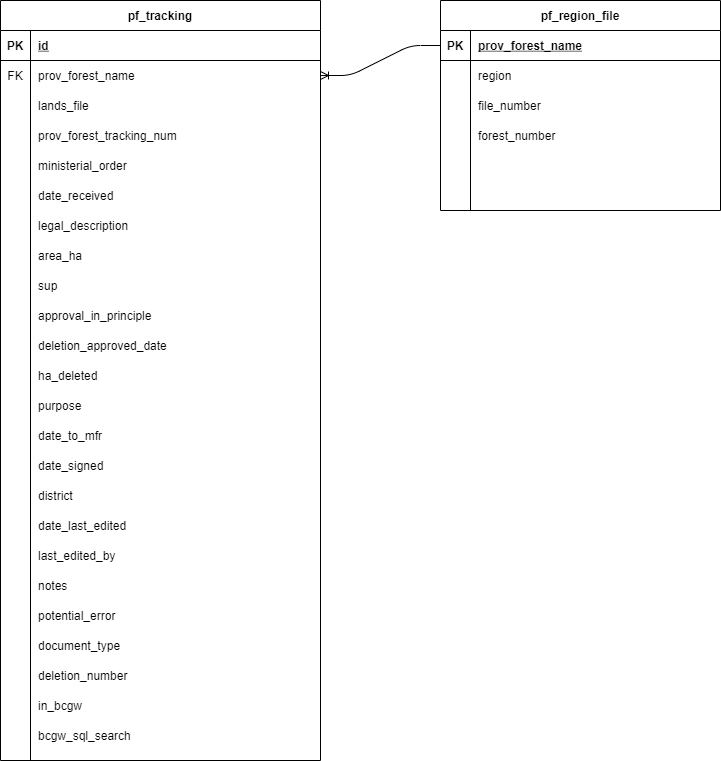

# Provincial Forest Tracker

An app built in Python for tracking Provincial Forest deletions in BC. It is essentially a CRUD (create, read, update, delete) app built purposely without the ability to delete records using the interface. 
This app is built with Flask, though it is not being deployed as a web application. [flaskwebgui](https://github.com/ClimenteA/flaskwebgui) is being used to make this Flask app run as a desktop application with the front-end built using HTML/CSS.

## Using the App
The PF Tracker app executable will be stored on the government network and is to be used by the FADM group and the Forest Tentures Branch for adding, viewing, or updating ongoing and past provincial forest deletions within BC.

To run the app, simply double-click the 'PF Tracker.exe'. Because the executable is typically running off the network, it can take some time to open. When it does open, it will open in the users default internet browser. One you are finished using the application, it should be closed simply by closing the browser tab.

To create a tracking number for a PF, simply select the forest from the drop down, scroll to the bottom of the table and click 'Create New PFT'. The tracking number will be created automatically and the user will be able to fill in additional information. 

Current active updates can be viewed by clicking the 'View Active Updates' button from the main menu.

Returning to the previous menu can be accomplished in most menus either by clicking 'Cancel' or by navigating with the back button in your internet browser. 


## Prerequisites

- Python 3.6+


## Requirements 

```
pip install Flask
pip install Flask-SQLAlchemy
pip install flaskwebgui

or

pip install -r requirements.txt
```

It is recommended to create a virtual environment with venv when setting up your Flask project. Pyinstaller is used to build an executable of this program for distribution and will also need to be installed in your virtual environment.


## Usage

If you are continuing development of this app, it is important to note the ways in which the app can run.  The main function contains 2 different ways of running the app; 1 for development and 1 for deployment. 

For development, the main function should be run in this configuration, which runs the app in Flask's debug mode allowing changes in the app to be viewed instantly:
```
app.run(debug=True)

# ui = FlaskUI(app)
# ui.app_mode=False
# ui.run()
```

For app deployment, the main function should be run in this configuration, allowing flaskwebgui to load the app automatically as a pseudo desktop app:
```
# app.run(debug=True)

ui = FlaskUI(app)
ui.app_mode=False
ui.run()
```


## Database

The Provincial Forest Tracker database is a simple SQLite database. It includes all the fields that were previously captured by the Provincial Forest tracking spreadsheet, along with new fields created to add functionality in tracking and reporting PF deletion status and history. Many of these fields are not used in the front-end application but are preserved for record keeping purposes. These fields and their simple relationships can be seen in the entity relationship diagram (ERD) below.

These database fields all have datatypes that can be viewed by examining the database (I recommend [DB Browser for SQLite](https://sqlitebrowser.org/)). Even though these fields are designated as TEXT, INTEGER, REAL, etc, SQLite does not inherently check data being entered into the database. This means any values can be placed into any column (Ex. The string ‘Hello’ could be placed into a field with datatype INTEGER). This can either be an annoying or a handy feature of SQLite depending on usage. For example, it is beneficial for our team to be able to put the string ‘Cancelled’ into the ‘deletion_number’ [INTEGER] column to signify a specific deletion was cancelled. 'Updates in Progress' are determined by selecting records which were received after 2019-01-01 AND are null in the 'deletion_number' column. The HTML input forms handle restricting input where needed.


<p align="center">
  
</p>


## Building the EXE
[PyInstaller](https://github.com/pyinstaller/pyinstaller) is used to create an executable of the app, allowing anyone with access to use it without needing to setup Python on their own machine. The command for creating the executable is
```
pyinstaller -F -w --add-data "./templates/*;templates" --add-data "./static/*;static" --icon=images\\forest1.ico app.py --name "PF Tracker"
```
The exe is created as a single file which requires extra logic within the app to handle locating the required files that are unpacked into 'sys._MEIPASS' upon running the exe. 
The only necessary file that accompanies the exe is the 'config.ini' file, which contains the full UNC path to the PF database and must be in the same folder as the executable. 